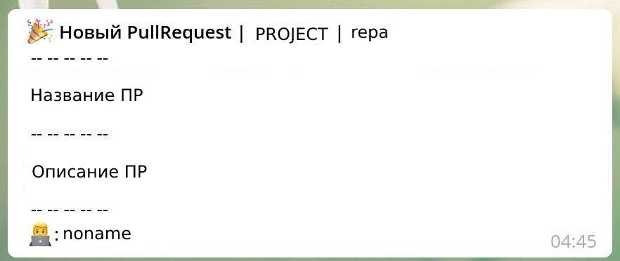
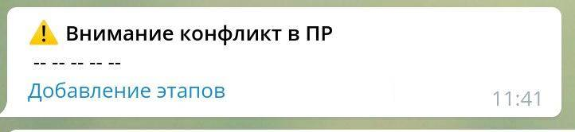
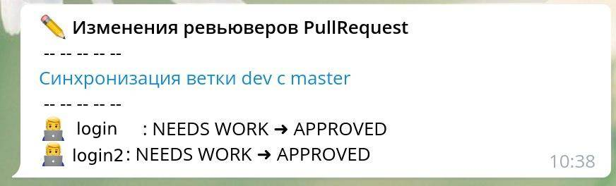
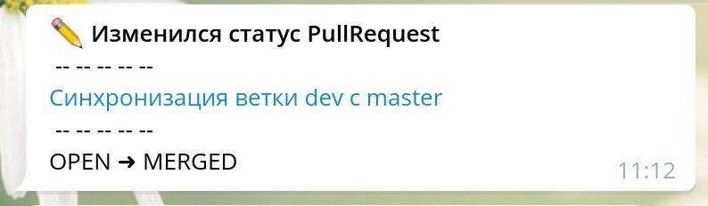
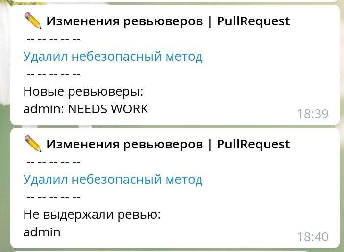
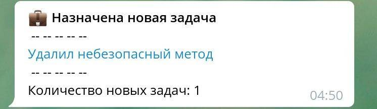
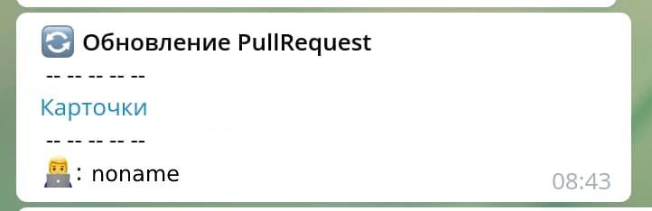
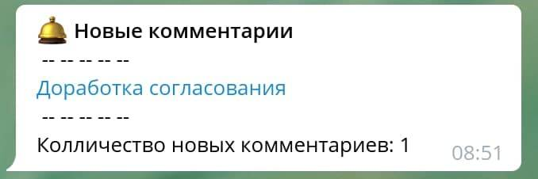
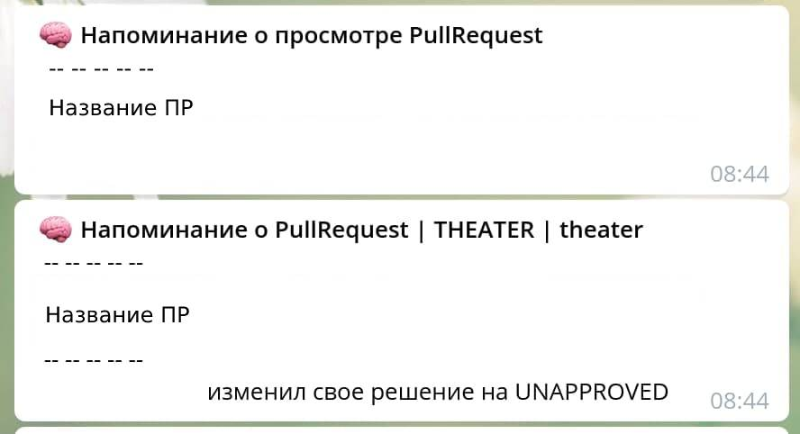

# Уведомления Bitbucket в Telegram

Это приложение позволит вам получать уведомления о событиях в вашем Bitbucket Server.

За основу взята серверная версия этого приложения: https://github.com/uPagge/bitbucketbot

## Возможности бота
1. Уведомление о новых PullRequest, в которых вас назначили ревьювером.

2. Уведомление о возникновении конфликта в вашем PullRequest

3. Уведомление об изменениях в статусах ревьюверов к вашему PullRequest

4. Уведомление об изменении статуса вашего ПР (мерж, удаление, деклайн)

5. Уведомление о добавлении и удалении ревьюверов в вашем PullRequest

6. Уведомление о создании задачи средствами Bitbucket в ваш PullRequest

7. Уведомление об обновлении PR, в котором вы ревьювер

8. Уведомление о новом комментарии в вашем ПР

9. Напоминания о просмотре PR. Это попытка создать умную систему уведомлений, которая будет ненавязчиво 
напоминать, что PR давно не просматривался. Например если прошло 2 часа, а вы так и не приняли решение, 
или если прошло уже 4 часа и кто-то вынес свое решение, а вы еще нет. Механизм еще будет дорабатываться.

## Запуск

### Docker
Для запуска можно использовать докер: https://hub.docker.com/r/upagge/bitbucket-bot-local